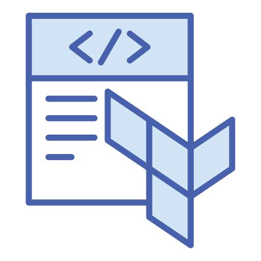

<p align="center">
  
  <h3 align="center" style="color:SlateBlue">Terraform Remote Backend Configuration</h3>
</p>

---

# Overview

This module configures a remote backend for Terraform, creating necessary resources in a specified AWS storage account to manage the Terraform state file securely and efficiently.

Setting up a remote backend in AWS allows all Terraform state files to be centralized and shared among team members, providing an improved security and state locking feature. This setup needs to be done once per AWS account and can be reused across multiple projects.

## Prerequisites

- AWS Account
- Configured AWS credentials in `~/.aws/credentials`
- Terraform installed on your machine

## Configuration Files

You need to create two configuration files for each account:
- `accounts/<account-name>.backend.conf`: Backend configuration file. Example:
  ```conf
  bucket         = "<aws_account_name>-terraform-state"
  region         = "<aws_region>"
  encrypt        = true
  kms_key_id     = "<aws_kms_key_alias>"
  dynamodb_table = "<aws_account_name>-terraform-lock"
  profile        = "<aws_profile>"
  ```
- `accounts/<account-name>.tfvars.json`: Variable file containing settings specific to the AWS account. Example:
  ```json
  {
    "aws_account_name": "<aws_account_name>",
    "aws_account": "<aws_account_id>",
    "aws_region": "<aws_region>",
    "aws_profile": "<aws_profile>"
  }
  ```

## Deployment Steps

### 1. Prepare the Backend Directory

- Navigate to the backend directory:
  ```bash
  cd deployments/backend
  ```

- Remove any existing Terraform initialization:
  ```bash
  rm -rf .terraform
  ```

- Temporarily disable the remote backend configuration in `main.tf` by commenting it out. This ensures Terraform uses a local backend initially.

### 2. Initialize and Apply Configuration

- Initialize Terraform:
  ```bash
  terraform init
  ```

- Create and configure the `tfvars.json` file under `../../accounts`:
  ```bash
  cp <example-file>.tfvars.json ../../accounts/<account-name>.tfvars.json
  # Edit the new file as necessary
  ```

- Create and configure the `backend.conf` file under `../../accounts`:
  ```bash
  cp <example-file>.backend.conf ../../accounts/<account-name>.backend.conf
  # Edit the new file as necessary
  ```

- Apply the configuration to set up the resources:
  ```bash
  terraform apply -var-file=../../accounts/<account-name>.tfvars.json
  ```

### 3. Enable and Migrate to the Remote Backend

- Re-enable the remote backend in `main.tf` by uncommenting the backend configuration block.

- Reinitialize Terraform to set up the remote backend:
  ```bash
  terraform init -backend-config=../../accounts/<account-name>.backend.conf
  # Confirm to migrate the state to the remote backend when prompted
  ```

- Clean up local state files:
  ```bash
  rm terraform.tfstate terraform.tfstate.backup
  ```

### 4. Verify Remote Backend Setup

- Confirm everything is configured correctly:
  ```bash
  terraform apply -var-file=../../accounts/<account-name>.tfvars.json
  ```

## Conclusion

Once these steps are completed, your Terraform configurations for the specified account will be managed through the AWS S3 remote backend, facilitating better collaboration and state management in your Terraform projects.

---